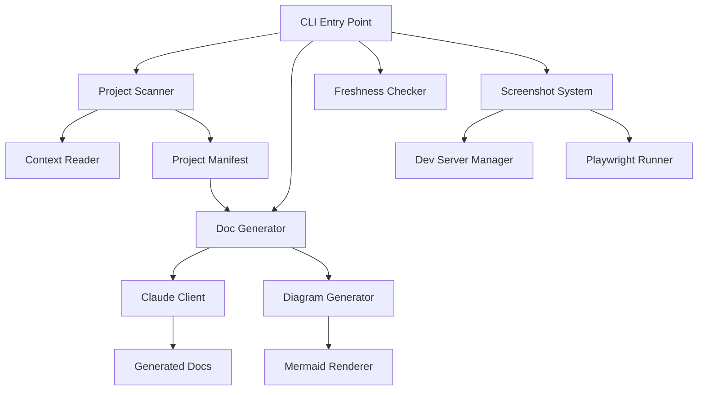
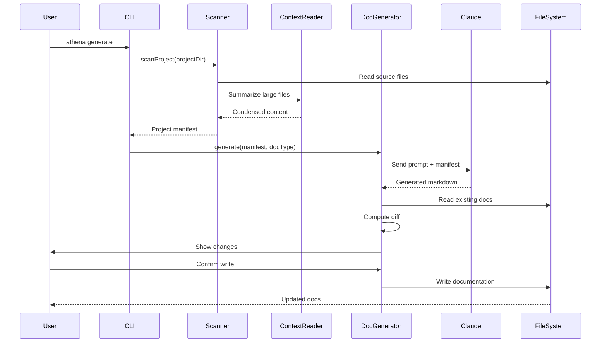

# Architecture

## Table of Contents

- [Architecture](#architecture)
  - [How It Works](#how-it-works)
  - [System Overview](#system-overview)
  - [Data Flow](#data-flow)
  - [Project Structure](#project-structure)
  - [Key Design Decisions](#key-design-decisions)
  - [Related Documentation](#related-documentation)

## How It Works

Athena is a documentation generator that analyzes your codebase and uses Claude AI to write comprehensive documentation. Here's what happens when you run it:

**When you run `athena generate`:**

1. The scanner walks through your project directory, discovering source files, analyzing package structure, and extracting functions, classes, and dependencies
2. It reads your existing documentation files (if any) to understand what's already documented
3. The context reader summarizes large files to fit within token limits
4. All this information gets packaged into a "project manifest" — a structured summary of your codebase
5. The manifest is sent to Claude AI with specialized prompts for each documentation type (README, ARCHITECTURE, API, etc.)
6. Claude generates markdown documentation based on the actual code structure
7. If you already have docs, Athena diffs them and shows you what changed before writing
8. For diagrams, if Mermaid CLI is installed, Athena renders them to PNGs; otherwise it embeds Mermaid code blocks

**Optional features:**

- **Screenshots**: Athena can spin up a dev server and use Playwright to capture screenshots of your running app
- **Changelog**: It can parse git tags and commit history to generate a changelog
- **Freshness check**: Compare your docs against your source code to see if they're outdated

The tool is designed to run locally, keeping your code private. It requires a Claude API key (stored in `.env`) but never sends code to third parties besides Anthropic.

## System Overview



## Data Flow



## Project Structure

```
athena/
├── src/
│   ├── cli.ts                  # Main CLI entry with Commander.js commands
│   ├── scanner.ts              # Walks project directory, builds manifest
│   ├── config.ts               # Loads .athena.yml configuration
│   ├── freshness.ts            # Checks if docs match current code
│   ├── generators/
│   │   ├── doc-generator.ts    # Orchestrates doc generation with Claude
│   │   └── claude-client.ts    # Anthropic API client wrapper
│   ├── diagrams/
│   │   ├── diagram-generator.ts # Generates architecture/flow diagrams
│   │   └── renderer.ts         # Renders Mermaid to PNG via CLI
│   ├── screenshots/
│   │   ├── dev-server.ts       # Spawns dev server for screenshot capture
│   │   └── cli-runner.ts       # Playwright screenshot orchestration
│   ├── changelog/
│   │   └── git-parser.ts       # Parses git tags and history
│   ├── scanners/
│   │   └── context-reader.ts   # Summarizes files to fit token limits
│   └── utils/
│       └── doc-helpers.ts      # Markdown parsing, TOC generation, cross-refs
├── prompts/                     # Claude prompt templates for each doc type
└── package.json
```

## Key Design Decisions

**Why TypeScript**: Type safety helps maintain complex data structures (manifests, configs) and provides better IDE support for contributors.

**Why Claude over GPT**: At time of writing, Claude has larger context windows and better code understanding, critical for processing entire codebases in one request.

**Scanner-first architecture**: By building a complete project manifest upfront, we can generate multiple docs (README, ARCHITECTURE, API) from the same scan without re-reading files.

**Diff-before-write**: Showing users what will change before overwriting docs prevents accidental loss of hand-written content and builds trust.

**Optional Mermaid rendering**: Embedding Mermaid code blocks makes docs portable (works on GitHub), but rendering to PNG helps non-technical stakeholders. Making it optional avoids forcing users to install extra dependencies.

**Local-first**: All processing happens locally. The only external call is to Claude's API. This keeps proprietary code secure and allows offline operation (after initial doc generation).

**Playwright for screenshots**: Playwright handles modern SPAs and provides cross-browser support. It's heavier than alternatives but more reliable for complex UIs.
---

## Related Documentation

- [Readme](README.md)
- [Deployment](DEPLOYMENT.md)
