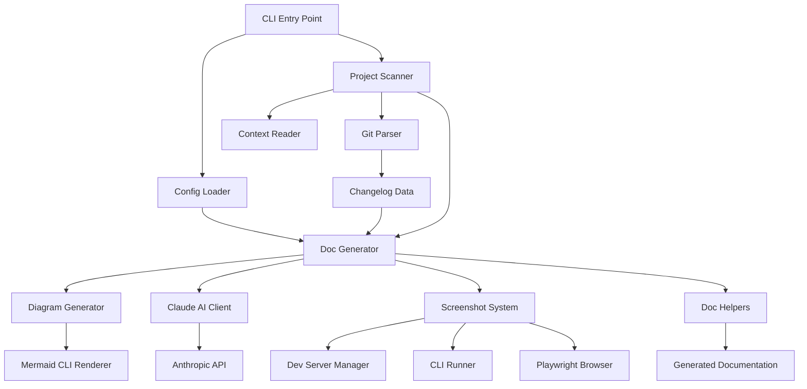
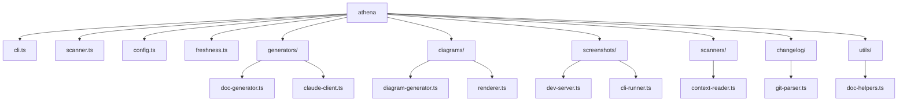
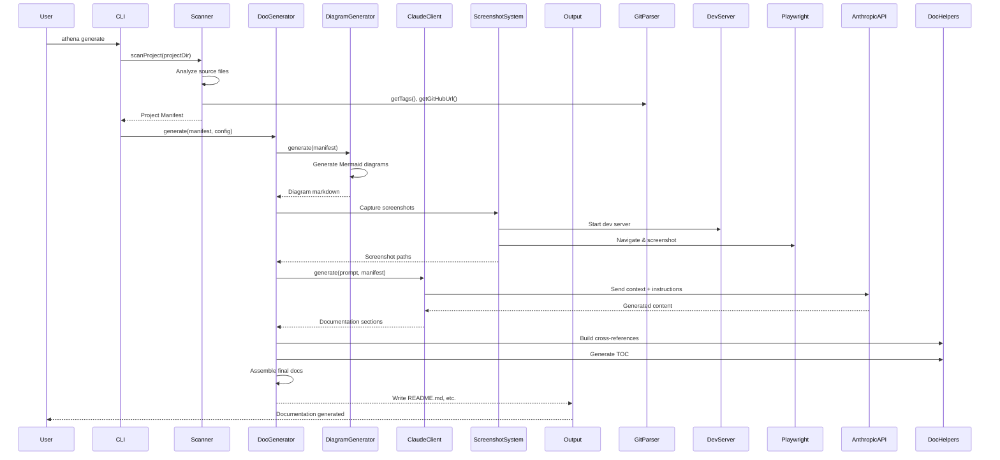

# ARCHITECTURE.md

## Table of Contents

- [ARCHITECTURE.md](#architecturemd)
  - [Overview](#overview)
  - [System Architecture](#system-architecture)
  - [Component Tree](#component-tree)
  - [Data Flow](#data-flow)
  - [Directory Structure](#directory-structure)
  - [Design Decisions](#design-decisions)
    - [1. AI-Powered Content Generation](#1-ai-powered-content-generation)
    - [2. Mermaid for Diagrams](#2-mermaid-for-diagrams)
    - [3. Playwright for Screenshots](#3-playwright-for-screenshots)
    - [4. Modular Pipeline Architecture](#4-modular-pipeline-architecture)
    - [5. Git Integration for Changelogs](#5-git-integration-for-changelogs)
    - [6. Configuration-Driven Behavior](#6-configuration-driven-behavior)
    - [7. TypeScript with Node.js](#7-typescript-with-nodejs)
  - [Dependencies](#dependencies)
    - [@anthropic-ai/sdk (^0.39.0)](#anthropic-aisdk-0390)
    - [commander (^13.0.0)](#commander-1300)
    - [diff (^7.0.0)](#diff-700)
    - [glob (^11.0.0)](#glob-1100)
    - [playwright (^1.58.2)](#playwright-1582)
  - [Related Documentation](#related-documentation)

## Overview

Athena is a TypeScript-based documentation generation tool that leverages AI (Claude) to automatically create and maintain project documentation. The system scans source code, analyzes project structure, generates diagrams using Mermaid, captures screenshots via Playwright, and synthesizes comprehensive documentation through the Anthropic Claude API.

The architecture follows a modular pipeline design with clear separation of concerns: scanning/analysis, diagram generation, screenshot capture, AI-powered content generation, and document assembly. Each stage processes the project manifest independently, allowing for incremental documentation updates and flexible customization through configuration files.

The tool is designed as a CLI application with a focus on developer workflows, supporting Git integration for changelog generation, diff-based freshness detection, and automated visual documentation through programmatic browser automation.

## System Architecture



## Component Tree



## Data Flow



## Directory Structure

```
athena/
├── src/
│   ├── cli.ts                      # CLI entry point
│   ├── scanner.ts                  # Project scanning orchestrator
│   ├── config.ts                   # Configuration loading
│   ├── freshness.ts                # Document freshness checker
│   ├── generators/
│   │   ├── doc-generator.ts        # Main documentation generator
│   │   └── claude-client.ts        # Anthropic API client
│   ├── diagrams/
│   │   ├── diagram-generator.ts    # Mermaid diagram generation
│   │   └── renderer.ts             # Diagram rendering utilities
│   ├── screenshots/
│   │   ├── dev-server.ts           # Development server manager
│   │   └── cli-runner.ts           # CLI-based screenshot capture
│   ├── scanners/
│   │   └── context-reader.ts       # Source code context extraction
│   ├── changelog/
│   │   └── git-parser.ts           # Git history parsing
│   └── utils/
│       └── doc-helpers.ts          # Documentation formatting utilities
├── dist/                           # Compiled JavaScript output
└── package.json
```

## Design Decisions

### 1. AI-Powered Content Generation
**Decision:** Use Anthropic Claude API for documentation synthesis rather than template-based generation.

**Rationale:** AI can understand code context, infer architectural patterns, and generate natural language descriptions that adapt to different project structures. This eliminates the need for rigid templates while maintaining consistency through structured prompts.

### 2. Mermaid for Diagrams
**Decision:** Generate diagrams using Mermaid syntax rather than image-based tools.

**Rationale:** Mermaid diagrams are text-based, version-controllable, and render natively in GitHub/GitLab markdown. This keeps documentation maintainable and reduces binary asset bloat in repositories.

### 3. Playwright for Screenshots
**Decision:** Use Playwright for screenshot capture instead of headless Chrome directly.

**Rationale:** Playwright provides cross-browser support, better stability, and more reliable element detection. It abstracts browser automation complexities and integrates well with modern development servers.

### 4. Modular Pipeline Architecture
**Decision:** Separate scanning, generation, and rendering into distinct modules with clear interfaces.

**Rationale:** Modularity allows independent testing, easier maintenance, and flexibility to swap implementations (e.g., different AI providers or diagram renderers) without cascading changes.

### 5. Git Integration for Changelogs
**Decision:** Parse Git tags and commit history rather than maintaining separate changelog files.

**Rationale:** Git is the source of truth for project history. Parsing tags and commits ensures changelogs stay synchronized with actual releases and reduces manual maintenance burden.

### 6. Configuration-Driven Behavior
**Decision:** Support external configuration files rather than command-line flags for customization.

**Rationale:** Configuration files (`.athenarc`, etc.) provide better ergonomics for complex setups, version-controlled settings, and team-wide consistency without lengthy CLI invocations.

### 7. TypeScript with Node.js
**Decision:** Build as a TypeScript CLI tool targeting Node.js rather than a web service.

**Rationale:** Documentation generation is a developer toolchain task best suited for local execution. TypeScript provides type safety for API integrations and complex data transformations, while Node.js ensures broad compatibility with existing developer environments.

## Dependencies

### @anthropic-ai/sdk (^0.39.0)
Official Anthropic SDK for Claude API integration. Chosen for type-safe API interactions, automatic request formatting, and built-in error handling. Provides streaming support for long-form content generation and token usage tracking for cost optimization.

### commander (^13.0.0)
De facto standard for Node.js CLI applications. Chosen for mature API, automatic help generation, subcommand support, and excellent TypeScript typings. Simplifies argument parsing and command routing without external configuration.

### diff (^7.0.0)
Text diffing library for detecting documentation staleness. Chosen for its implementation of the Myers diff algorithm, which provides human-readable change detection. Used to compare generated documentation against existing files to determine update necessity.

### glob (^11.0.0)
File pattern matching for project scanning. Chosen for fast, cross-platform glob expansion with gitignore support. Essential for discovering source files while respecting project ignore patterns.

### playwright (^1.58.2)
Browser automation for screenshot capture. Chosen over Puppeteer for superior cross-browser support (Chromium, Firefox, WebKit), better network interception, and more reliable element waiting strategies. Provides consistent screenshot results across different environments.
---

## Related Documentation

- [Readme](README.md)
- [Api](API.md)
- [Deployment](DEPLOYMENT.md)
- [Contributing](CONTRIBUTING.md)
