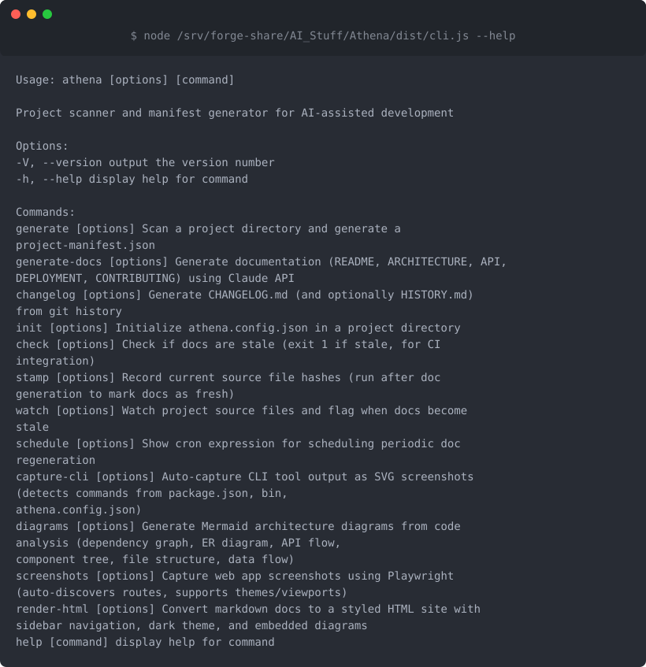
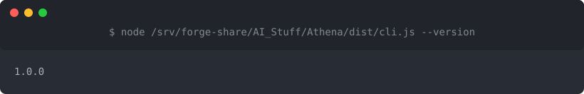

# Athena

## Table of Contents

- [Athena](#athena)
  - [What is this?](#what-is-this)
  - [Screenshots](#screenshots)
  - [Quick Start](#quick-start)
  - [How to Use](#how-to-use)
  - [Features](#features)
  - [Installation](#installation)
  - [Configuration](#configuration)
  - [Tech Stack](#tech-stack)
  - [License](#license)
  - [Related Documentation](#related-documentation)

**AI-powered documentation that stays fresh with your code**



## What is this?

Athena automatically generates and updates your project documentation by analyzing your codebase. Instead of letting your docs get stale while your code evolves, Athena uses AI to write clear, accurate documentation that reflects what your project actually does right now. It's perfect for maintainers who want great docs without the manual effort.

## Screenshots


*All available Athena commands - generate docs, check freshness, create diagrams, and build changelogs*


*Check your installed Athena version*

## Quick Start

1. **Install Athena**
   ```bash
   npm install -g athena
   ```

2. **Set up your API key** (Athena uses Claude AI)
   ```bash
   export ANTHROPIC_API_KEY=your_api_key_here
   ```

3. **Generate documentation for your project**
   ```bash
   cd your-project
   athena generate
   ```

4. **Check your new docs** - Look for generated markdown files in your project directory

5. **Keep docs fresh** - Run `athena freshness` anytime to check if your docs are out of sync with your code

## How to Use

**Generate Documentation**

Run `athena generate` in your project root. Athena will scan your codebase, analyze the structure, and create comprehensive documentation. It automatically detects your project's language and framework.

**Check Documentation Freshness**

As you change your code, run `athena freshness` to see if your documentation is still accurate. Athena compares your current codebase against what's documented and highlights what's changed.

**Create Architecture Diagrams**

Use `athena diagram` to automatically generate visual representations of your project's structure. Great for onboarding new team members or planning refactors.

**Build Changelogs**

Run `athena changelog` to generate a changelog from your git history. Athena analyzes commits and tags to create a readable summary of what's changed between versions.

**Capture Screenshots**

If your project has a UI, use `athena screenshots` to automatically capture screenshots of key screens. These get embedded in your documentation.

## Features

- **Automatic documentation generation** - Write docs by running one command
- **Freshness checking** - Know when your docs are out of sync with code changes
- **Multi-language support** - Works with TypeScript, JavaScript, and detects frameworks automatically
- **Architecture diagrams** - Visualize your project structure with auto-generated diagrams
- **Screenshot capture** - Automatically grab UI screenshots for documentation
- **Changelog generation** - Build changelogs from git history
- **AI-powered writing** - Uses Claude AI to write clear, human-friendly documentation
- **Configurable** - Customize what gets documented and how with an `.athena.json` config file
- **Git-aware** - Integrates with your repository for changelogs and change detection

## Installation

**Prerequisites**

- Node.js 18 or higher
- An Anthropic API key ([get one here](https://www.anthropic.com))
- Optional: Mermaid CLI for diagram rendering (`npm install -g @mermaid-js/mermaid-cli`)
- Optional: Playwright for screenshot capture (installs automatically with Athena)

**Install globally**

```bash
npm install -g athena
```

**Or use with npx** (no installation needed)

```bash
npx athena generate
```

**Set up your API key**

Athena needs access to Claude AI. Set your API key as an environment variable:

```bash
export ANTHROPIC_API_KEY=your_api_key_here
```

Or add it to your shell profile (`.bashrc`, `.zshrc`, etc.) to make it permanent:

```bash
echo 'export ANTHROPIC_API_KEY=your_api_key_here' >> ~/.zshrc
```

## Configuration

Create an `.athena.json` file in your project root to customize behavior:

```json
{
  "include": ["src/**/*.ts", "lib/**/*.js"],
  "exclude": ["**/*.test.ts", "dist/**"],
  "outputDir": "docs",
  "diagramFormat": "mermaid"
}
```

**Configuration options:**

- `include` - Glob patterns for files to scan (default: all code files)
- `exclude` - Glob patterns to ignore (default: node_modules, test files)
- `outputDir` - Where to write generated docs (default: project root)
- `diagramFormat` - Diagram format preference (default: mermaid)

## Tech Stack

Built with modern TypeScript tools:

- **TypeScript** - Type-safe codebase
- **Commander** - CLI interface
- **Anthropic SDK** - Claude AI integration for documentation generation
- **Playwright** - Automated screenshot capture
- **Glob** - File pattern matching for codebase scanning
- **Diff** - Change detection for freshness checking

## License

MIT
---

## Related Documentation

- [Architecture](ARCHITECTURE.md)
- [Deployment](DEPLOYMENT.md)
